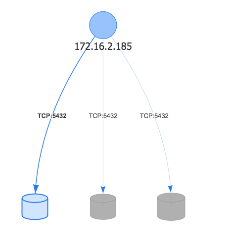

# aws-network-visualizer

# Screenshots

## MVP
* Web frontend that collects AWS Flow Logs and graphs dependencies

## Requirements
This is intended to be used with AWS Account auth management + Google based user domain

Before running, you'll need to get start an AWS Cognito project and get a Google client id.

## TODO
* <s>PoC Graphing library</s>
* <s>Create VPC Flow LogGroup</s>
* PoC AWS Account auth from browser
* Restrict to only certain domain

## AWS Cognito notes
* Add Google as an Identity provider with Client Secret in IAM
* In order to restrict by domain , the Google App and client secret need to be created by 

